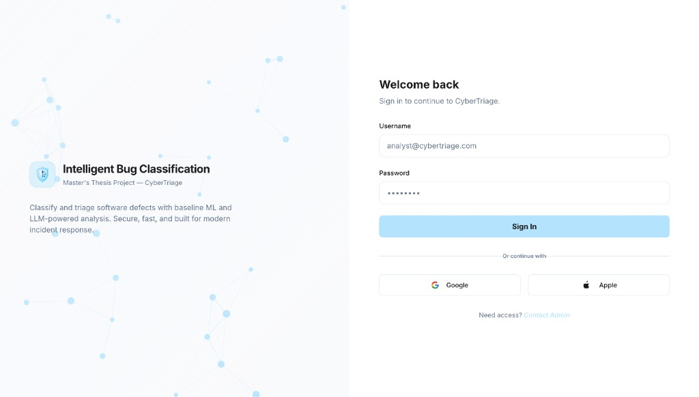
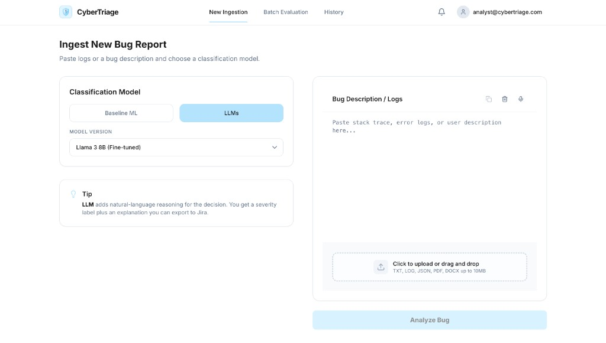
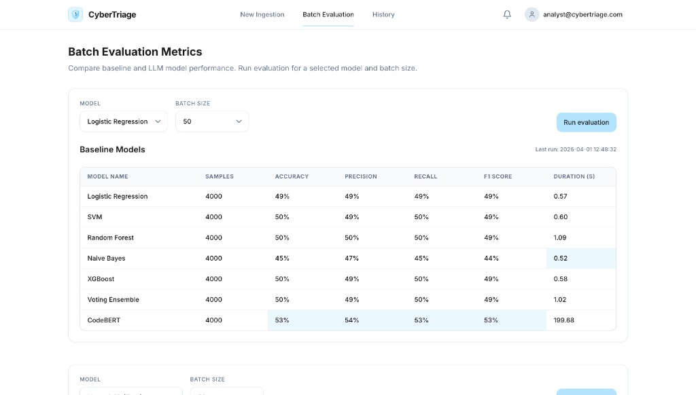
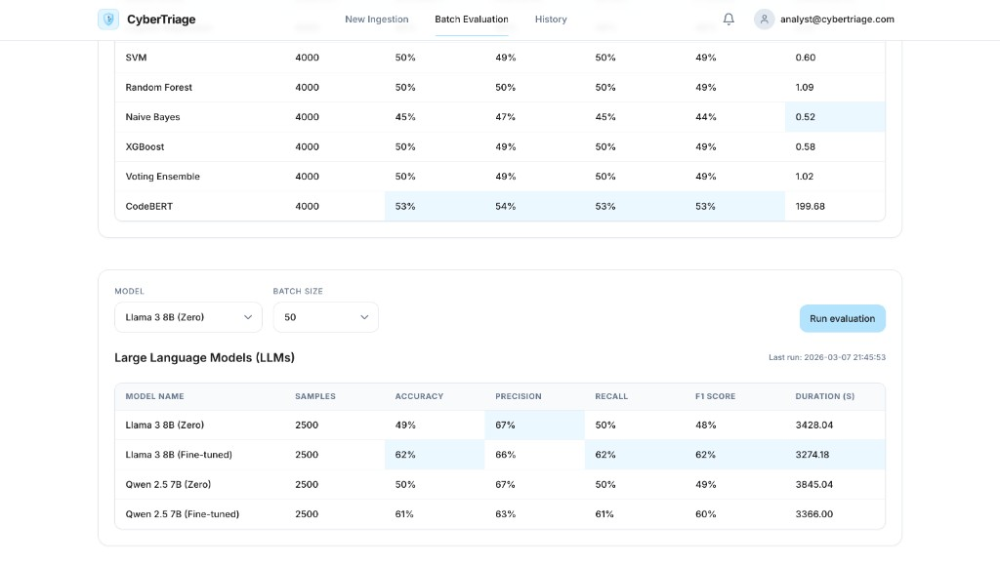
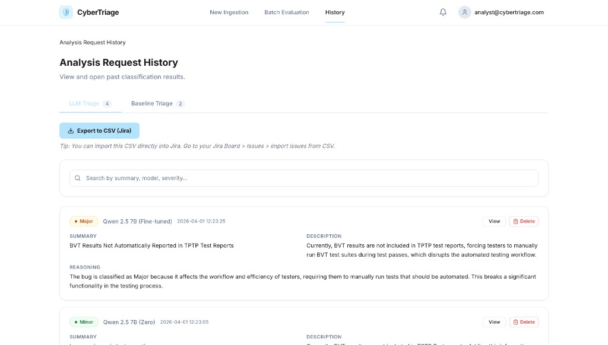
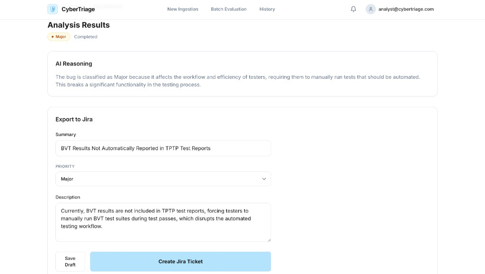
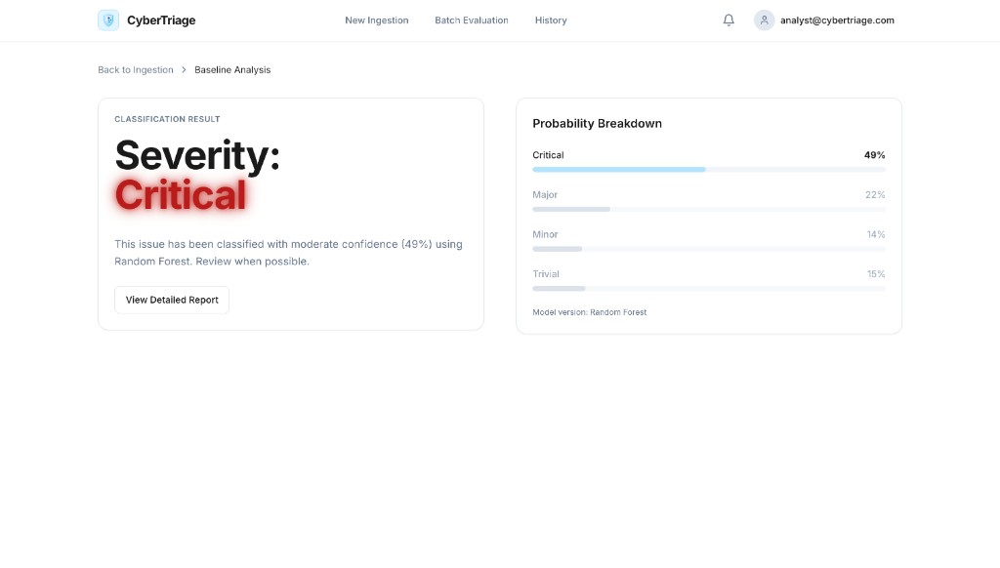

# CyberTriage

**Intelligent Bug Classification** — CyberTriage is a local-first web platform for MSc thesis research on automated bug severity triage. Analysts sign in, paste bug text or upload documents (`TXT`, `LOG`, `JSON`, `PDF`, `DOCX`), and run inference with **classical baselines** (TF-IDF + ML, plus CodeBERT) or **local LLMs** (zero-shot and fine-tuned GGUF via Ollama). The app supports **batch evaluation** to compare models on holdout data, **history** with export to CSV for tools like Jira, and separate flows for **baseline probability views** versus **LLM reasoning** with draft Jira fields.

It combines:
- **Classical baselines** (TF-IDF + ML),
- **Transformer baseline** (CodeBERT),
- **LLM workflows** (zero-shot + fine-tuned GGUF),
in one unified FastAPI + React application.

## Table of Contents

- [Screenshots](#screenshots)
- [Overview](#overview)
- [Architecture](#architecture)
- [Quick Start](#quick-start)
- [Model Catalog](#model-catalog)
- [API Endpoints](#api-endpoints)
- [Batch Evaluation](#batch-evaluation)
- [Project Structure](#project-structure)
- [Data Models Results Guides](#data-models-results-guides)
- [Reproducibility and GitHub Notes](#reproducibility-and-github-notes)
- [Troubleshooting](#troubleshooting)

## Screenshots

Below is a quick tour of the CyberTriage UI (all assets live under [`screenshots/`](screenshots/)).

### Welcome



### New ingestion

Paste logs or descriptions, pick baseline vs LLM family and model version, upload files, then run **Analyze Bug**.



### Batch evaluation

Compare baseline and LLM metrics (accuracy, precision, recall, F1, duration) on your evaluation splits; run evaluations with configurable batch size.





### History

Browse past triage results, filter LLM vs baseline runs, search, and export to CSV for Jira import.



### Analysis results

**LLM path:** severity, natural-language reasoning, and **Export to Jira** with prepopulated summary, priority, and description.



**Baseline path:** severity with confidence and a **probability breakdown** across classes.



## Overview

CyberTriage classifies software bug reports into:
- `Critical`
- `Major`
- `Minor`
- `Trivial`

In addition to severity prediction, the system supports:
- document ingestion (`PDF`, `DOCX`, `TXT`, `LOG`, `JSON`),
- in-app batch evaluation for baseline and LLM families,
- persisted local history (`results/history_entries.json`),
- registry-driven model extensibility.

## Architecture

### Runtime stack
- **Backend:** FastAPI (`api/server.py`)
- **Frontend:** React + Vite (`frontend/`)
- **Inference layer:** engine adapters in `src/engines/`
- **Model registry:** `src/engines/registry.py`

### Core design principles
1. **Model-agnostic integration:** UI/API call `list_models()` and `get_engine(model_id)`.
2. **Local-first runtime:** models, datasets, and generated outputs are local artifacts.
3. **Decoupled reasoning for fine-tuned experts:** severity classification and explanatory reasoning are orchestrated in API flow.

## Quick Start

### 1) Start backend + frontend together

```bash
./run.sh
```

Starts:
- Backend: `http://127.0.0.1:8000`
- Frontend: `http://localhost:3000`

### 2) Start backend only

```bash
./start_backend.sh
```

### 3) Start frontend only

```bash
cd frontend
npm run dev
```

### Environment notes
- Backend startup scripts create/activate `.venv` automatically if missing.
- Backend dependencies are installed from `requirements-backend.txt` by startup scripts.
- Frontend dependencies are managed via `frontend/package.json`.

## Model Catalog

### Baseline group

| Model ID | Display name |
|---|---|
| `lr` | Logistic Regression |
| `svm` | SVM |
| `rf` | Random Forest |
| `nb` | Naive Bayes |
| `xgb` | XGBoost |
| `ensemble` | Voting Ensemble |
| `codebert` | CodeBERT |

### LLM group

| Model ID | Display name |
|---|---|
| `ollama` | Llama 3 8B (Zero) |
| `qwen` | Qwen 2.5 7B (Zero) |
| `llama_finetuned` | Llama 3 8B (Fine-tuned) |
| `qwen_finetuned` | Qwen 2.5 7B (Fine-tuned) |

Model registration source of truth: `src/engines/registry.py`.

## API Endpoints

### Model discovery and prediction
- `GET /api/models` - list available model IDs and display names
- `POST /api/predict` - run severity prediction

### Evaluation
- `GET /api/evaluation` - read merged baseline/LLM metrics from `results/`
- `POST /api/evaluation/run` - trigger evaluation script by model family and `batch_size`

### History persistence
- `GET /api/history` - read persisted entries
- `POST /api/history` - save/update an entry
- `DELETE /api/history/{entry_id}` - delete one entry

### Document parsing
- `POST /api/parse-document` - parse uploaded document text (`PDF`, `DOCX`, text files)

## Batch Evaluation

### Baselines

```bash
# all baseline models
python scripts/evaluate_baselines.py

# single baseline model
python scripts/evaluate_baselines.py --model codebert --batch-size 4000
```

### LLM evaluations

```bash
python scripts/evaluate_llama_zeroshot.py --batch-size 50
python scripts/evaluate_llama_finetuned.py --batch-size 50
python scripts/evaluate_qwen_zeroshot.py --batch-size 50
python scripts/evaluate_qwen_finetuned.py --batch-size 50
```

All generated outputs are written to `results/`.

## Project Structure

```text
thesis-bug-triage/
├── api/                    # FastAPI app and route orchestration
├── frontend/               # React application
├── src/engines/            # Inference engines + registry
├── scripts/                # Training/evaluation scripts
├── utils/                  # Shared utilities (metrics, text helpers)
├── dataset/                # Local dataset files and prep scripts
├── models/                 # Local model artifacts
├── results/                # Generated metrics/predictions/history
├── screenshots/            # README UI screenshots
├── context /               # Project/thesis architecture and methodology docs
└── colab_scripts/          # Colab notebooks for training experiments
```

## Data, Models, Results Guides

- Dataset guide: `dataset/DATASET_GUIDE.md`
- Models guide: `models/MODELS_GUIDE.md`
- Results guide: `results/RESULTS_GUIDE.md`
- LLM training data logic: `context /LLM_TRAINING_LOGIC.md`

## Reproducibility and GitHub Notes

This project treats large runtime artifacts as local-only assets:
- dataset CSV/JSONL files,
- GGUF model binaries,
- baseline `.pkl` artifacts,
- generated results CSV/JSON.

Model artifacts are stored in Google Drive folders:
- baseline models: https://drive.google.com/drive/folders/1W59o9fKTFAbfb09XlMoq6Xt6AoATqUyg?usp=sharing
- LLM models: https://drive.google.com/drive/folders/1qpyJjpyisDQzqzYO4OongFN20IugFFhC?usp=sharing
- CodeBERT models: https://drive.google.com/drive/folders/1WqrYaTk9AW-z8xzVYYRrqauur9EG_V6q?usp=sharing
- dataset splits: https://drive.google.com/drive/folders/1Hh2dVq1PnKy2Mpxzky96a-ZEbU1DyInP?usp=sharing

These are excluded from normal source-control flow (see `.gitignore`) and should be regenerated per environment.

## Troubleshooting

### Missing model artifacts
- Baseline missing: run `python scripts/train_baseline.py`
- CodeBERT missing: ensure `codebert_model/` includes tokenizer/config/weights files
- GGUF missing: place required `.gguf` files under `models/llm/`

### Ollama not reachable
- Start Ollama locally and ensure required models are available.

### History not persisted
- Confirm backend is running and can write to `results/history_entries.json`.
