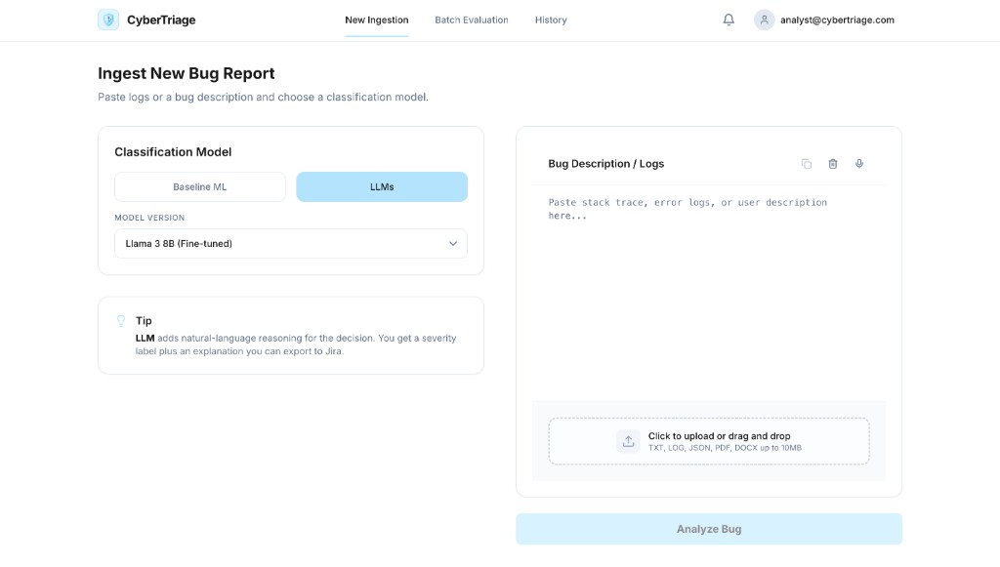
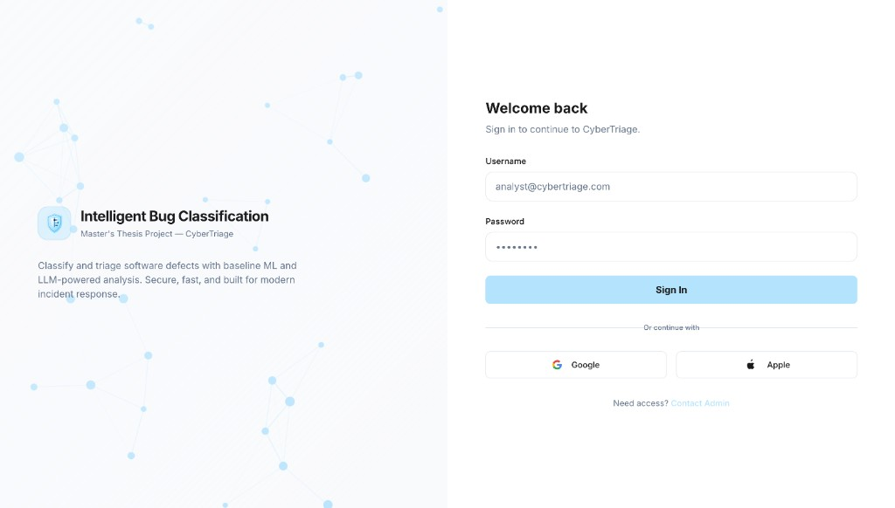
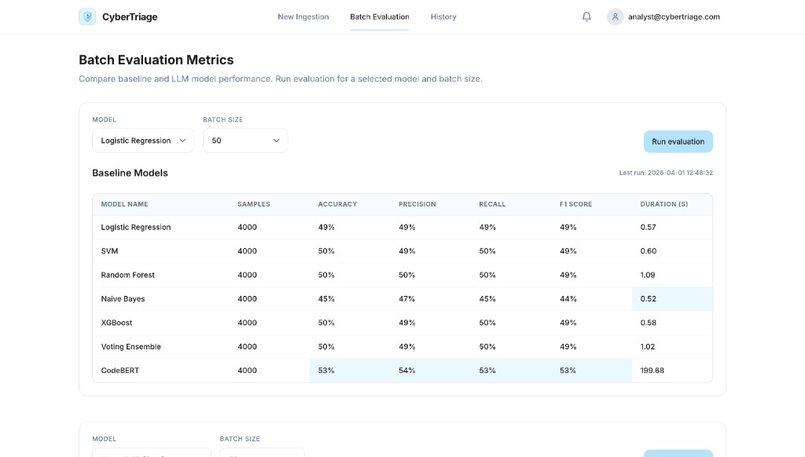
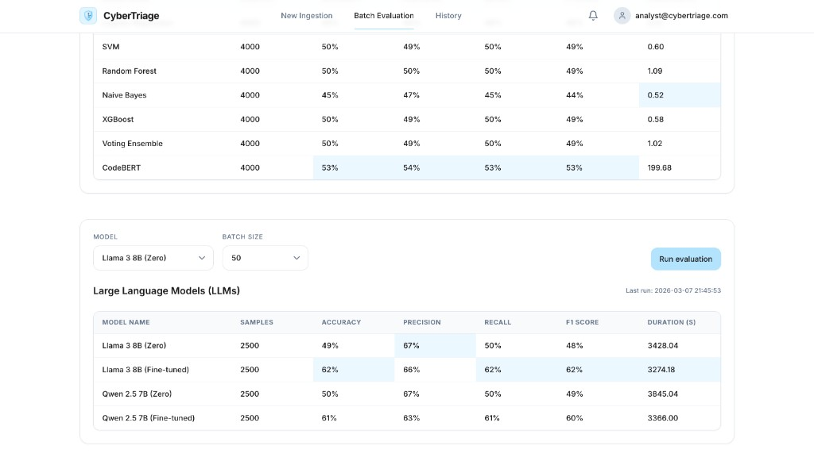
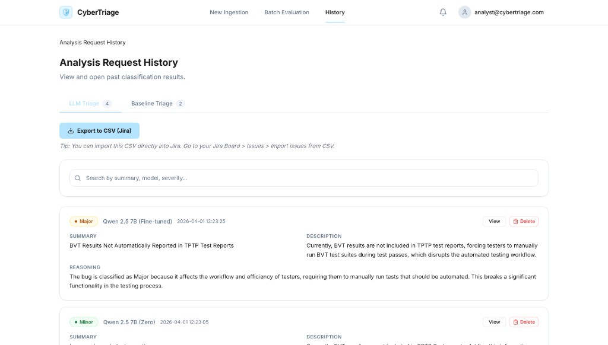
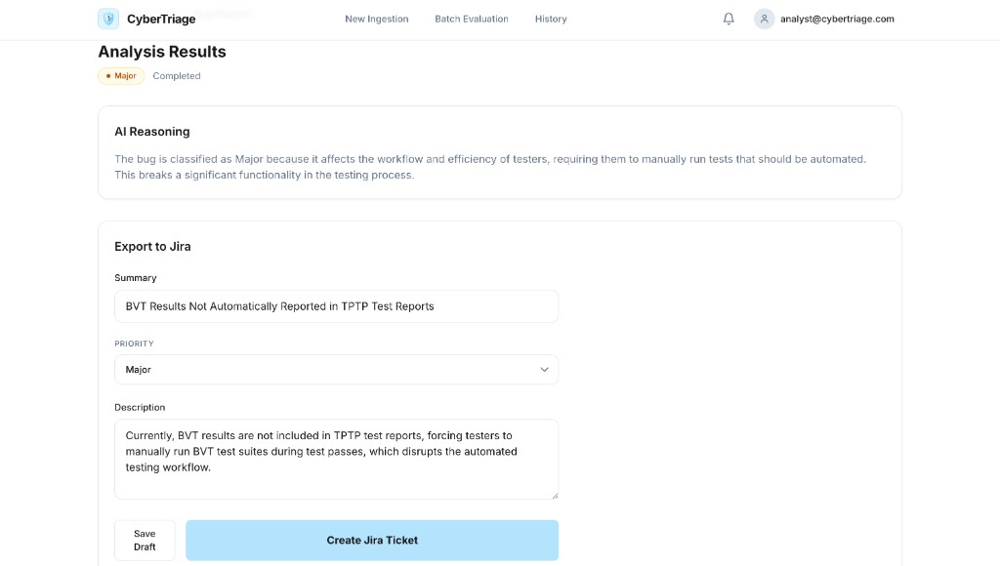
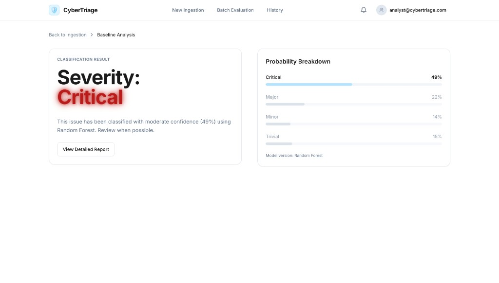
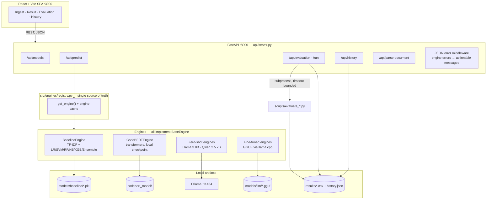
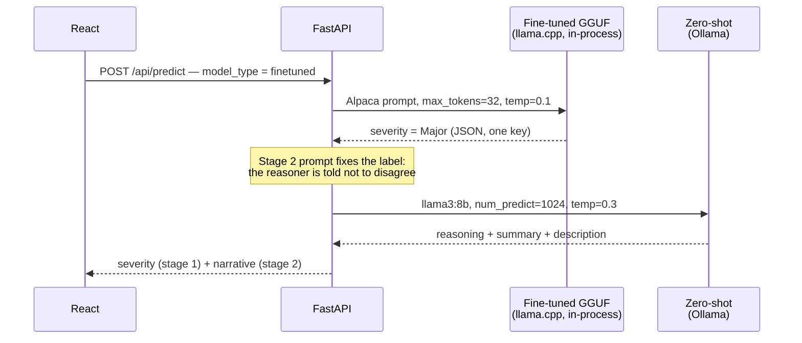

# CyberTriage — Bug Severity Triage with Classical ML, CodeBERT, and Local LLMs

CyberTriage is a local-first triage workstation for software bug reports. An analyst pastes a bug report (or drops in a `PDF`/`DOCX`/`LOG`/`JSON`), picks one of **11 registered models**, and gets back a severity label — with a probability breakdown for the classical models, or natural-language reasoning plus a draft Jira ticket for the LLMs. The same app runs the batch evaluations that produced every number in this README.



`Python 3.10+` · `FastAPI` · `React 18 + Vite + Tailwind` · `scikit-learn` · `XGBoost` · `CodeBERT` · `Llama 3 8B` · `Qwen 2.5 7B` · `Unsloth + LoRA` · `llama.cpp (GGUF)` · `Ollama`

> MSc thesis project (Nazarbayev University). The headline finding is not "LLMs win" — it is that a **125M-parameter fine-tuned CodeBERT beats a LoRA-fine-tuned 8B Llama 3 on macro F1 while running 26× faster**, and that both are only 3–4 macro-F1 points ahead of a TF-IDF + Random Forest that runs in a millisecond. All of that is measured, not asserted. See [Evaluation](#evaluation).

---

## Contents

- [What it does](#what-it-does)
- [Screenshots](#screenshots)
- [Architecture](#architecture)
- [How it works](#how-it-works)
  - [Model choice](#model-choice)
  - [Prompt and context strategy](#prompt-and-context-strategy)
  - [Fine-tuning setup](#fine-tuning-setup)
  - [The two-stage ingestion pipeline](#the-two-stage-ingestion-pipeline)
- [Evaluation](#evaluation)
  - [Results](#results)
  - [What the failures look like](#what-the-failures-look-like)
  - [Latency and cost](#latency-and-cost)
- [Failure modes and guardrails](#failure-modes-and-guardrails)
- [Data provenance](#data-provenance)
- [Backend design](#backend-design)
- [API reference](#api-reference)
- [Getting started](#getting-started)
- [Configuration](#configuration)
- [Reproducing the results](#reproducing-the-results)
- [Project structure](#project-structure)
- [Known gaps](#known-gaps)
- [License](#license)

---

## What it does

- **Classifies bug reports into four severities** — `Critical`, `Major`, `Minor`, `Trivial` — using any of 11 registered models behind one interface.
- **Ingests real artifacts, not just textareas.** `PDF` (pypdf), `DOCX` (python-docx), and `TXT`/`LOG`/`JSON` (UTF-8 with a Latin-1 fallback), capped at 10MB server-side. There is also browser-native speech-to-text on the ingestion screen for dictating a report.
- **Renders two different result surfaces** depending on what the model can actually tell you: classical models get the full probability distribution across all four classes (and `1.0` with a one-hot for `LinearSVC`, which has no `predict_proba` — the UI does not invent a confidence it does not have); LLMs get generated reasoning plus an editable Jira draft (summary / priority / description).
- **Runs batch evaluations from inside the app.** The evaluation screen triggers the same CLI scripts a researcher would run by hand, then reads the resulting CSVs back into a comparison table.
- **Persists triage history server-side** (`results/history_entries.json`) with search, per-entry delete, and bulk **Export to CSV** in Jira's import format.
- **Adds a model without touching the API or the UI.** Implement `BaseEngine`, add one line to the registry, done — the model selector, the predict endpoint, and the result router all discover it at runtime.

---

## Screenshots

**Welcome.** Local-only session gate; no server-side identity (see [Known gaps](#known-gaps)).



**Batch evaluation, classical baselines.** Accuracy / precision / recall / F1 / wall-clock duration, read from `results/baseline_comparison.csv`, with a configurable batch size that subsamples the fixed holdout set.



**Batch evaluation, LLMs.** The same table for the four LLM configurations, so zero-shot and fine-tuned variants are compared on identical splits and identical metric code.



**History.** Every triage run persisted server-side, filterable by LLM vs baseline, exportable as a Jira-ready CSV (`Issue Type, Summary, Description, Priority`).



**LLM result path.** Severity, the model's own reasoning, and a pre-populated Jira ticket the analyst edits before filing.



**Baseline result path.** Severity plus the full `predict_proba` / softmax distribution — the honest view for a model that has no explanation to give.



---

## Architecture


```mermaid
flowchart TB
    subgraph FE["React + Vite SPA :3000"]
        UI["Ingest · Result · Evaluation · History"]
    end

    subgraph API["FastAPI :8000 — api/server.py"]
        R1["/api/models"]
        R2["/api/predict"]
        R3["/api/evaluation · /run"]
        R4["/api/history"]
        R5["/api/parse-document"]
        MW["JSON error middleware<br/>engine errors → actionable messages"]
    end

    subgraph REG["src/engines/registry.py — single source of truth"]
        CACHE["get_engine() + engine cache"]
    end

    subgraph ENG["Engines — all implement BaseEngine"]
        E1["BaselineEngine<br/>TF-IDF + LR/SVM/RF/NB/XGB/Ensemble"]
        E2["CodeBERTEngine<br/>transformers, local checkpoint"]
        E3["Zero-shot engines<br/>Llama 3 8B · Qwen 2.5 7B"]
        E4["Fine-tuned engines<br/>GGUF via llama.cpp"]
    end

    subgraph STORE["Local artifacts"]
        A1[("models/baseline/*.pkl")]
        A2[("codebert_model/")]
        A3["Ollama :11434"]
        A4[("models/llm/*.gguf")]
        A5[("results/*.csv + history.json")]
    end

    UI -->|"REST, JSON"| API
    R2 --> CACHE --> ENG
    E1 --> A1
    E2 --> A2
    E3 --> A3
    E4 --> A4
    R3 -->|"subprocess, timeout-bounded"| SCRIPTS["scripts/evaluate_*.py"]
    SCRIPTS --> A5
    R3 --> A5
    R4 --> A5
```

**Why this shape.**

The thesis question is a comparison across three model families that share nothing at runtime — a pickled scikit-learn pipeline, a PyTorch transformer, an HTTP call to Ollama, and an in-process llama.cpp context. Wiring those into an API directly would put four sets of loading semantics, four failure modes, and four output shapes into every route handler.

Instead, everything goes behind a five-line abstract interface (`src/engines/base_engine.py`: `model_id`, `display_name`, `predict(text) -> dict`), and the registry is the only place that knows a model exists. `api/server.py` never imports a model class; it calls `get_engine(model_id)`. The frontend never hardcodes a model list; it calls `GET /api/models` and falls back to a static list only if the backend is unreachable. Adding Qwen after Llama was already shipped meant writing one engine file and appending one registry line.

The registry also caches instantiated engines (`_ENGINE_CACHE`), which matters concretely: `FinetunedEngine._load_model()` maps a ~4.9GB GGUF file into memory, and `CodeBERTEngine._load()` pulls a full PyTorch checkpoint. Both load lazily on first `predict()` and stay resident. Without the cache, every request would pay a multi-second model load; with eager loading at import time, starting the server would require every model artifact to be present, which defeats the point of being able to run the app with only the baselines downloaded.

---

## How it works

### Model choice

Eleven models, three families, all reporting into the same four-class label space and the same metric function (`utils/metrics.py`).

| Group | `model_id` | Model | Runtime | Why it's here |
| --- | --- | --- | --- | --- |
| Classical | `lr` `svm` `rf` `nb` `xgb` `ensemble` | TF-IDF + LogReg / LinearSVC / RandomForest / MultinomialNB / XGBoost / soft-voting ensemble | scikit-learn, in-process | The floor. If a 20k-feature bag of n-grams gets 50%, an 8B LLM had better beat it. |
| Transformer | `codebert` | `microsoft/codebert-base`, fine-tuned | transformers + torch | Bug reports are half prose, half stack traces. CodeBERT is pretrained on exactly that mixture. |
| LLM, zero-shot | `ollama` `qwen` | `llama3:8b`, `qwen2.5:7b` | Ollama HTTP | The "just prompt it" hypothesis, tested rather than assumed. |
| LLM, fine-tuned | `finetuned` `qwen_finetuned` | LoRA r=32 on `unsloth/llama-3-8b-bnb-4bit` and `unsloth/qwen2.5-7b-bnb-4bit`, exported to `q4_k_m` GGUF | llama.cpp, in-process | What supervision buys over prompting, on identical data. |

**What was rejected and why.**

- **Zero-shot LLMs were rejected as the product default.** Both scored *below* the dumbest classical baseline: Llama 3 8B at 0.305 macro F1 and Qwen 2.5 7B at 0.321, against 0.444 for Naive Bayes. The failure is not randomness, it is calibration — see [What the failures look like](#what-the-failures-look-like).
- **The fine-tuned 8B Llama was rejected as the accuracy default.** It reaches 0.526 macro F1, which is *lower* than CodeBERT's 0.532 from a model with 64× fewer parameters, at 26× the per-sample latency. Fine-tuning is kept in the product for its explanatory output, not its numbers.
- **The soft-voting ensemble was rejected as the classical default.** It scores 0.490 macro F1 — below plain Random Forest at 0.494 — while costing roughly 2× the inference time. Averaging four correlated TF-IDF models does not add information.
- **Ollama tags are pinned** (`llama3:8b`, not `llama3:latest`). A silent upstream re-tag would invalidate every zero-shot number in this README, and unlike an API model there would be no changelog to catch it.

### Prompt and context strategy

The single most important design decision here is **prompt parity**. The same Alpaca-style wrapper is used in four places — `dataset/2_convert_to_jsonl.py` (training data), the Colab tuning notebooks, `scripts/evaluate_*.py` (evaluation), and `src/engines/*.py` (serving):

```
Below is an instruction that describes a task, paired with an input that provides further context. Write a response that appropriately completes the request.

### Instruction:
{instruction}

### Input:
{input}

### Response:
```

Without parity, the zero-shot vs fine-tuned comparison measures prompt formatting as much as it measures fine-tuning, and the served model sees a different distribution than the trained one. Each engine file carries an explicit comment tying its `INSTRUCTION` constant back to the dataset generator so the two can't silently drift.

**Severity-first JSON ordering.** The target schema always emits `severity` as the first key:

```json
{"severity": "Major", "reasoning": "…", "summary": "…", "description": "…"}
```

Autoregressive decoding means later keys are hostage to earlier ones. Putting the label first makes the classification survive truncation, a low `num_predict`, or a mid-generation stop token — the fields that only affect presentation are the ones that get cut.

**Token budget.** Input is truncated to 4,000 characters (`raw[:4000]`) against a 4,096-token context. Bug reports in this corpus are dominated by pasted Java stack traces, where the discriminating signal — the exception type, the first frames, the reporter's prose — is front-loaded; the tail is repeated framework frames. Truncation is head-first for that reason. Generation budgets are asymmetric and deliberate: the fine-tuned classifiers get `max_tokens=32` (they emit one JSON key and nothing else), while the zero-shot reasoner gets `num_predict=1024`.

**Decoding.** `temperature=0.1` for classification and `0.3` for the reasoner — low enough to be near-deterministic on the label, warm enough that explanations aren't degenerate. `repeat_penalty=1.15` on the GGUF path, plus family-specific stop tokens (`<|eot_id|>` for Llama 3, `<|im_end|>` for Qwen 2.5) because a wrong stop token turns a 32-token classification into a 32-token fragment of the next hallucinated example.

**Structured output is parsed defensively, in three tiers** (`_extract_json_object` → `_normalize_severity`):

```python
# 1. whole response is JSON
obj = json.loads(text)
# 2. JSON is embedded in prose — take first '{' to last '}'
snippet = text[text.find("{") : text.rfind("}") + 1]
# 3. no JSON at all — scan the raw text for any severity keyword
for label in SEVERITY_OPTIONS:
    if label.lower() in re.sub(r"[^\w\s]", " ", text).lower():
        return label
return "Minor"          # last resort: the majority class, never a crash
```

This is not defensive programming for its own sake — tier 3 is load-bearing. Zero-shot Llama 3 routinely prefaces JSON with "Here is the analysis:", and occasionally answers in prose only. A parser that returned `None` would have silently dropped rows from the evaluation and biased the numbers; instead every row gets a label and the errors show up honestly in the confusion matrix.

### Fine-tuning setup

Both 7–8B models were trained identically so the comparison is about the model, not the recipe.

| | |
| --- | --- |
| Method | LoRA via Unsloth, 4-bit base (`bnb-4bit`) |
| Rank / alpha / dropout | `r=32`, `α=32`, `0.05` |
| Target modules | `q_proj, k_proj, v_proj, o_proj, gate_proj, up_proj, down_proj` |
| Sequence length | 4,096 |
| Epochs / LR / schedule | 3 · `1e-4` · cosine, 10% warmup |
| Batch | 2 per device × 4 grad-accum = effective 8 |
| Optimizer | `paged_adamw_8bit`, weight decay 0.01 |
| Seeds | `3407` (LoRA + trainer), `42` everywhere else |
| Export | `q4_k_m` GGUF for llama.cpp serving |
| Hardware | A100 40GB (Colab), ~3h per model |

`r=32` was selected over `r=8` and `r=16` in a rank sweep (2.98h / 3.00h / 3.01h wall-clock — rank barely moves training time at this scale, so the larger rank was effectively free). Attaching adapters to all seven projection matrices rather than just `q_proj`/`v_proj` follows the same logic: the marginal cost is small relative to the 4-bit base, and the task needs the MLP blocks to learn a rubric, not just re-weight attention.

CodeBERT was fine-tuned separately as a plain sequence classifier: `microsoft/codebert-base`, 3 epochs, `lr=2e-5`, batch 16, `max_length=512`, weight decay 0.01, seed 42 — see [`colab_scripts/codebert_colab_finetune.ipynb`](colab_scripts/codebert_colab_finetune.ipynb).

### The two-stage ingestion pipeline

The fine-tuned models are trained on a severity-only target — `{"severity": "<label>"}` and nothing else. That is what makes them accurate, and it also means they have nothing to show an analyst. Meanwhile the zero-shot models write fluent explanations and classify badly.

So ingestion for a fine-tuned model splits the job:


```mermaid
sequenceDiagram
    participant UI as React
    participant API as FastAPI
    participant FT as Fine-tuned GGUF<br/>(llama.cpp, in-process)
    participant ZS as Zero-shot<br/>(Ollama)

    UI->>API: POST /api/predict — model_type = finetuned
    API->>FT: Alpaca prompt, max_tokens=32, temp=0.1
    FT-->>API: severity = Major (JSON, one key)
    Note over API: Stage 2 prompt fixes the label:<br/>the reasoner is told not to disagree
    API->>ZS: llama3:8b, num_predict=1024, temp=0.3
    ZS-->>API: reasoning + summary + description
    API-->>UI: severity (stage 1) + narrative (stage 2)
```

The constraint that makes this sound is that **stage 2 is never allowed to change the label**. `_build_reasoner_instruction()` hands the reasoner the severity as a given and instructs it not to disagree, so the accuracy the evaluation table reports is the accuracy the user sees. A naive "just ask the big model for everything" design would report stage-1 numbers while shipping stage-2 predictions.

Stage 2 is also strictly optional. If Ollama is down, `_call_zero_shot_reasoner` catches, logs, and returns empty strings — the severity still renders, only the narrative is missing. Degraded, not broken.

Zero-shot models skip stage 2 entirely; they already return all four fields in one pass, and the API just normalises the field names (`summary` → `analysis_summary`) so the result screens have one contract to render.

---

## Evaluation

Every model is scored by the same function (`utils.metrics.compute_metrics`) on the same stratified holdout, with accuracy, macro precision, macro recall, macro F1, and wall-clock duration. Macro averaging is the right metric here because the dataset is balanced by construction and because under-calling `Critical` is the expensive error — macro F1 refuses to let a model coast on the classes it happens to like.

**Reproducibility controls:** fixed seed `42` for balancing, splitting, and every evaluation subsample; a holdout set generated once and never regenerated between runs; a shared `models/baseline/config.json` that pins label→integer ordering so a string-label model and an integer-label model can't be silently misaligned.

**Read the sample sizes.** Classical and CodeBERT rows are scored on all 4,000 holdout rows. LLM rows are scored on a seeded 2,000-row subsample of the same holdout — at ~1.4s per sample, the full set would be ~1.5 hours per configuration and four configurations were needed. The subsample is stratified by construction (the holdout is balanced) and drawn with the same seed for all four LLMs, so LLM-vs-LLM comparisons are exact and LLM-vs-baseline comparisons carry a sampling caveat.

### Results

All numbers below are read directly from the CSVs in [`results/`](results/), produced by the scripts in [`scripts/`](scripts/). Random chance on four balanced classes is **0.250**.

| Model | Family | n | Accuracy | Macro P | Macro R | **Macro F1** | Duration | ms / sample |
| --- | --- | ---: | ---: | ---: | ---: | ---: | ---: | ---: |
| Naive Bayes | TF-IDF | 4000 | 0.4495 | 0.4722 | 0.4495 | 0.4439 | 0.52s | 0.13 |
| SVM (LinearSVC) | TF-IDF | 4000 | 0.4953 | 0.4882 | 0.4952 | 0.4887 | 0.60s | 0.15 |
| Voting Ensemble | TF-IDF | 4000 | 0.4978 | 0.4922 | 0.4978 | 0.4904 | 1.02s | 0.26 |
| Logistic Regression | TF-IDF | 4000 | 0.4935 | 0.4894 | 0.4935 | 0.4908 | 0.57s | 0.14 |
| XGBoost | TF-IDF | 4000 | 0.4950 | 0.4902 | 0.4950 | 0.4917 | 0.58s | 0.15 |
| **Random Forest** | TF-IDF | 4000 | 0.5012 | 0.4951 | 0.5013 | **0.4939** | 1.09s | 0.27 |
| Llama 3 8B — zero-shot | LLM | 2000 | 0.3675 | 0.5313 | 0.3703 | 0.3051 | 2742s | 1371 |
| Qwen 2.5 7B — zero-shot | LLM | 2000 | 0.3740 | 0.5350 | 0.3768 | 0.3212 | 3076s | 1538 |
| Qwen 2.5 7B — fine-tuned | LLM | 2000 | 0.5185 | 0.5097 | 0.5166 | 0.4851 | 2693s | 1346 |
| Llama 3 8B — fine-tuned | LLM | 2000 | 0.5270 | 0.5704 | 0.5259 | 0.5259 | 2619s | 1310 |
| **CodeBERT** | Transformer | 4000 | **0.5312** | 0.5353 | 0.5312 | **0.5322** | 199.68s | 49.9 |

**Four things this table says.**

1. **Fine-tuning is what makes an LLM usable here — prompting is not.** Llama 3 goes from 0.305 → 0.526 macro F1 (+72% relative) on identical data and an identical prompt. Qwen 2.5 goes 0.321 → 0.485. Zero-shot, both models are beaten by Naive Bayes.
2. **Scale lost to task-specific pretraining.** CodeBERT (125M params, fine-tuned) edges out LoRA-fine-tuned Llama 3 8B on macro F1 (0.532 vs 0.526) while being 26× faster per sample. For a triage queue, that is not a close call.
3. **The classical floor is high and the ceiling is low.** TF-IDF + Random Forest reaches 0.494 in ~1 second for 4,000 documents. The best model in the study beats it by 3.8 macro-F1 points. Most of the remaining error is not a modelling failure (next section).
4. **Zero-shot macro precision is misleading on its own** — 0.531 for Llama 3, higher than its fine-tuned self on two of four classes. It is an artifact of near-total abstention: the model almost never says `Critical`, so the few times it does, it is often right. Recall of 0.370 is the number that matters.

### What the failures look like

**Zero-shot models collapse onto the middle of the scale.** Predicted-label distribution over the 2,000-row holdout, against a true distribution that is 25% per class:

| Predicted | Llama 3 zero-shot | Qwen 2.5 zero-shot | Llama 3 fine-tuned | True |
| --- | ---: | ---: | ---: | ---: |
| Critical | 5.4% | 4.5% | 14.0% | 24.8% |
| Major | 29.3% | 23.4% | 43.3% | 25.3% |
| **Minor** | **63.8%** | **67.7%** | 23.4% | 24.6% |
| Trivial | 1.6% | 4.5% | 19.3% | 25.5% |

Zero-shot Llama 3 assigns `Minor` to nearly two thirds of everything and achieves **0.041 recall on `Trivial`** and **0.162 on `Critical`** — it has essentially learned "hedge toward the middle" from its instruction-tuning prior, and no amount of rubric text in the prompt fixes it. Fine-tuning does fix it: the fine-tuned distribution is within ~18 points of uniform on every class instead of ~39. It does not fix it perfectly — the fine-tuned model over-produces `Major` (43% vs a true 25%), which is where most of its remaining precision loss lives (0.412 precision on `Major`).

**Most surviving errors are one step on the scale.** Confusion matrix, fine-tuned Llama 3 (rows = true, columns = predicted):

|  | Critical | Major | Minor | Trivial |
| --- | ---: | ---: | ---: | ---: |
| **Critical** | 177 | 293 | 16 | 9 |
| **Major** | 82 | 357 | 54 | 12 |
| **Minor** | 9 | 153 | 242 | 87 |
| **Trivial** | 12 | 63 | 156 | 278 |

**825 of 946 errors (87.2%) are adjacent-class confusions** — `Critical`↔`Major` or `Minor`↔`Trivial`. Catastrophic errors are rare: only 25 `Critical` reports out of 495 were called `Minor` or `Trivial`. The same pattern holds for fine-tuned Qwen (79.1% adjacent) and for both zero-shot models (~81%).

That reframes the ceiling. A large share of the residual error is **label noise in the source data, not model failure**: the ground truth is the severity a human reporter typed into Bugzilla, and the `Critical`/`Major` boundary is exactly where reporters disagree with each other. A model at 0.53 macro F1 with 87% of its errors one step off the true label is roughly tracking human inter-annotator agreement on this taxonomy.

**What I would try next, and have not built:**

1. **Ordinal loss instead of 4-way cross-entropy.** Every model here is trained to treat `Critical`-called-`Trivial` and `Critical`-called-`Major` as the same mistake. Given that 87% of errors are adjacent, an ordinal regression head or a distance-weighted loss should convert directly into macro F1.
2. **Collapse to a 3-class or binary taxonomy** (`Critical+Major` vs `Minor+Trivial`) and re-measure. If accuracy jumps to the high 70s, that is strong evidence the 4-class ceiling is annotation noise, and it is also the decision a triage queue actually needs.
3. **An abstention band.** Route low-confidence predictions to a human instead of guessing. Most classical models already expose `predict_proba` and CodeBERT exposes a softmax; the plumbing exists, the policy does not.
4. **A held-out human re-annotation set.** ~200 reports labelled independently, to measure the inter-annotator agreement this whole analysis currently only infers.

### Latency and cost

Measured on the evaluation runs above; local Apple Silicon for serving, A100 40GB for training.

| Stage | Configuration | Measured |
| --- | --- | --- |
| Inference | TF-IDF + classical | **0.13–0.27 ms** / report |
| Inference | CodeBERT (local, PyTorch) | **50 ms** / report |
| Inference | 7–8B GGUF, `q4_k_m`, `max_tokens=32` | **1.31–1.35 s** / report |
| Inference | 7–8B zero-shot via Ollama, `num_predict=150` | **1.37–1.54 s** / report |
| Ingestion, end-to-end | Fine-tuned path = stage 1 + stage 2 reasoner | **~1.3s + up to ~10s** |
| Training | LoRA r=32, 16k rows, 3 epochs, A100 40GB | **~3h** per model |
| Cold start | GGUF mmap (~5GB) on first `predict()` | seconds; amortised by the engine cache |
| **API cost** | everything runs locally | **$0.00** |

Two consequences the code reflects. First, the fine-tuned ingestion path can exceed 10 seconds because stage 2 generates up to 1,024 tokens — hence a 120s client-side `AbortController` timeout with a message that names the cheaper option ("try a shorter input or a baseline model") rather than a spinner that never resolves. Second, batch LLM evaluation is a 45–50 minute job, which is why `/api/evaluation/run` carries a 7,200s timeout for LLMs against 600s for baselines instead of one shared number.

Running locally is the point, not a limitation: bug reports routinely contain customer data, internal hostnames, and unpatched vulnerabilities. Nothing in this system leaves the machine.

---

## Failure modes and guardrails

| When this happens | What the system does | Where |
| --- | --- | --- |
| Model returns prose instead of JSON | Three-tier parse: strict → substring → keyword scan → `"Minor"`. Never raises, never drops the row. | `src/engines/*.py::_extract_json_object` |
| Model returns an unknown label (`"P1"`, `"blocker"`) | `_normalize_severity()` maps case-insensitively onto the four valid options, then falls back to a keyword scan of the whole response. | `src/engines/*.py` |
| Fine-tuned model returns a JSON *string* in `reason` | Re-parsed into an object at the API boundary so the frontend has one shape to render. | `api/server.py::_normalize_llm_reason` |
| Ollama is not running | `ConnectionError` → `RuntimeError` carrying the literal fix: *"Start Ollama and run: ollama run llama3:8b"*. | zero-shot engines |
| Ollama times out (>120s) | Explicit `Timeout` branch suggesting a baseline model instead of a generic 500. | zero-shot engines |
| Stage-2 reasoner fails mid-ingestion | Caught and logged; empty narrative returned, **severity still delivered**. Partial success beats total failure. | `api/server.py::_call_zero_shot_reasoner` |
| `.pkl` / `.gguf` / CodeBERT weights missing | `_predict_error_detail()` pattern-matches the exception and returns the exact command or file path that fixes it. | `api/server.py` |
| Any unhandled exception | Middleware **and** exception handler both guarantee `application/json` — FastAPI's default 500 is HTML, which the frontend's `res.json()` cannot parse. | `api/server.py::catch_all_exceptions` |
| Empty or whitespace-only input | Short-circuited in every engine before the model loads; returns `confidence: 0.0` rather than classifying noise. | all engines |
| Upload too large / empty / undecodable | 400 with a specific reason. 10MB cap, UTF-8 → Latin-1 → 400. | `api/server.py::parse_document` |
| Evaluation script fails or hangs | Non-zero exit → 502 with the first 500 chars of stderr; overrun → 504. Timeouts are per-family (600s / 7200s). | `api/server.py::run_evaluation` |
| History file grows without bound | Writes are capped at the 2,000 most recent entries. | `api/server.py::_save_history_entries` |
| History file is corrupt or hand-edited | `_load_history_entries()` returns `[]` and filters non-dict rows rather than crashing the app on startup. | `api/server.py` |
| Evaluation CSVs missing or malformed | `GET /api/evaluation` always returns 200 with empty arrays — a missing artifact must not blank the whole screen. | `api/server.py::evaluation` |

The unifying rule: **an error message names the command that fixes it.** A stack trace saying `FileNotFoundError: models/baseline/lr.pkl` becomes *"Model files not found. For baseline models run: python scripts/train_baseline.py"*.

---

## Data provenance

**Source.** [`AndressaStefany/bug-reports`](https://huggingface.co/datasets/AndressaStefany/bug-reports) on Hugging Face — real Bugzilla reports (predominantly Eclipse), with reporter-assigned severity. Fields used: `description` (free text, frequently containing Java stack traces) and `bug_severity`.

**Label mapping** (`dataset/1_prep_balance_split_csv.py`), collapsing Bugzilla's scale to a four-point rubric:

| Bugzilla | CyberTriage |
| --- | --- |
| `blocker`, `critical` | **Critical** |
| `major` | **Major** |
| `minor` | **Minor** |
| `trivial` | **Trivial** |
| `normal`, `enhancement` | *dropped* |

`normal` is dropped because it is Bugzilla's default value — it is where reporters land when they do not choose, so it carries no severity signal and would swamp every other class. `enhancement` is dropped because it is a feature request, not a bug.

**Balancing and splitting.** Random undersampling to exactly **5,000 rows per class** (20,000 total), then a stratified **80/20** split → **16,000 train / 4,000 test**, `random_state=42` throughout. Balancing is deliberate: it makes accuracy interpretable against a 0.25 chance line and stops every model from learning the majority class as a strategy. It also means these numbers do not describe a real triage queue's class distribution — a production deployment would need re-weighting or threshold tuning against the live prior.

**Leakage controls.**

- Split happens once, in `1_prep_balance_split_csv.py`, before any model sees data. Every downstream consumer reads the same frozen `train.csv` / `test.csv`.
- `2_convert_to_jsonl.py` derives `train.jsonl` / `test.jsonl` from those exact files, so the LLM and classical tracks share a split rather than each drawing their own.
- LLM evaluation scripts load `test.jsonl` **only** — never `train.jsonl` — and the module docstrings say so explicitly.
- `evaluate_baselines.py` replicates the training-time preprocessing exactly (`transform`, never `fit_transform`) so the TF-IDF vocabulary is never refit on test data.
- Both the label ordering (`models/baseline/config.json`) and the batch subsampling seed are shared across scripts, so no model is scored against a differently-ordered or differently-sampled target vector.

**Redistribution.** No dataset rows, model weights, or generated results are committed. They are regenerated by the scripts, or downloaded from the Drive folders linked in [Getting started](#getting-started).

---

## Backend design

The AI is one section of this project; the rest is a backend. What is worth pointing at:

**Errors are translated at the boundary, not leaked.** `_predict_error_detail()` sits between raw engine exceptions and the HTTP response and maps each known failure class to an actionable message. Both a `@app.middleware("http")` wrapper *and* an `add_exception_handler(Exception, …)` are registered — not redundancy for its own sake, but because they catch at different layers, and FastAPI's uncaught-exception default is an HTML 500 that the frontend's `res.json()` would fail to parse, turning a clear backend error into an opaque frontend one.

**Lazy loading and caching are correctness requirements, not optimisations.** `get_engine()` memoises instances, and each heavy engine defers artifact loading to first `predict()`. Eager construction would make server startup depend on every model artifact being present — so a contributor who only wants to run the classical baselines could not start the app at all. The order matters too: `_load_model()` checks `MODEL_PATH.exists()` *before* importing `llama_cpp`, so a missing GGUF produces "place `llama_finetuned.gguf` in `models/llm/`" rather than an import error about a library the user does not need.

**Long-running work is subprocess-isolated with per-family timeouts.** `/api/evaluation/run` shells out to the evaluation scripts via `subprocess.run` with `sys.executable` (inheriting the active venv rather than whatever `python` resolves to), `cwd=ROOT`, captured stdout/stderr, and 600s / 7,200s timeouts chosen from the measured durations above. Running a 45-minute llama.cpp evaluation in-process would block the event loop and leak GGUF memory into the API process; a crashed child just returns 502 with its stderr. `model_id` is validated against an allowlist before it reaches the command array, and arguments are passed as a list — never a shell string — so no request-controlled value can become a shell token.

**Persistence is small, safe, and honest about it.** History is a JSON file with read-repair (`[]` on corruption, non-dict rows filtered), upsert-by-id semantics, and a 2,000-entry cap. It is not a database and the README says so in [Known gaps](#known-gaps) — but it survives a restart, which `useState` does not, and that was the actual requirement.

**The frontend degrades rather than breaks.** `client.js` wraps every request in an `AbortController` timeout, reads the body as text *before* attempting `JSON.parse` so a non-JSON error can still be surfaced verbatim, and unwraps FastAPI's three `detail` shapes (string, validation-array, object). `IngestScreen` falls back to a static model list if `/api/models` is unreachable, so the UI renders and shows a real error instead of an empty dropdown. CORS is an explicit four-origin allowlist (ports 3000 and 5173, both `localhost` and `127.0.0.1`) rather than `*`, and Vite proxies `/api` in dev while `VITE_API_URL` overrides the base for other deployments.

---

## API reference

Base URL `http://127.0.0.1:8000`. All responses are JSON, including errors (`{"detail": "…"}`).

### `GET /api/models`
Registry-backed model list. The frontend builds its selector from this — model IDs are not hardcoded client-side.
```json
[{"id": "lr", "name": "Logistic Regression"}, {"id": "codebert", "name": "CodeBERT"}, "…"]
```

### `POST /api/predict`
```jsonc
// request — model_type and model_id are accepted interchangeably
{"text": "NullPointerException on save; workspace unrecoverable…", "model_type": "rf"}
```
```jsonc
// classical / CodeBERT response
{
  "severity": "Critical",
  "confidence": 0.61,
  "probabilities": {"Critical": 0.61, "Major": 0.22, "Minor": 0.11, "Trivial": 0.06},
  "model": "rf"
}
```
```jsonc
// LLM response — adds the generated fields; fine-tuned models fill these from stage 2
{
  "severity": "Critical",
  "reasoning": "The report describes an unrecoverable workspace state with no workaround…",
  "summary": "Workspace corrupted after NPE on save",
  "description": "…",
  "analysis_summary": "…", "analysis_description": "…",
  "confidence": 1.0, "model": "finetuned"
}
```
`400` — missing/blank `text`, missing or unknown `model_id`. `500` — engine failure, with the message translated by `_predict_error_detail()`.

### `GET /api/evaluation`
Merged baseline + LLM metrics with `last_run_*` timestamps from CSV mtimes. **Always 200** — missing CSVs yield empty arrays, never an error screen.

### `POST /api/evaluation/run`
```jsonc
{"type": "baseline", "model_id": "codebert", "batch_size": 4000}
// type: "baseline" → lr|svm|rf|nb|xgb|ensemble|codebert   (600s timeout)
// type: "llm"      → ollama|qwen|finetuned|qwen_finetuned (7200s timeout)
```
Blocking. `400` unknown id · `502` script failed (stderr included) · `504` timed out.

### `GET` / `POST` `/api/history` · `DELETE /api/history/{entry_id}`
Read all entries, upsert one, delete one. `POST` takes `{"entry": {...}}` and upserts by `entry.id` — prepending, or replacing in place on an id collision — then truncates to the 2,000 most recent. `DELETE` is idempotent and reports `{"success": true, "removed": false}` when the id was already gone.

### `POST /api/parse-document`
`multipart/form-data`, field `file`. Returns `{"text": "…"}`. PDF → pypdf, DOCX → python-docx, everything else → UTF-8 then Latin-1. `400` on >10MB, empty, or undecodable.

---

## Getting started

**Prerequisites:** Python 3.10+ · Node 18+ · [Ollama](https://ollama.com) (only for the LLM paths).

```bash
git clone https://github.com/asset8k/bug-triage-app.git
cd bug-triage-app
./run.sh          # creates .venv, installs requirements-backend.txt, starts both servers
```

Backend on `http://127.0.0.1:8000`, frontend on `http://localhost:3000`. Or run them separately with `./start_backend.sh` and `npm run dev --prefix frontend`.

**The app starts with no model artifacts** — every engine loads lazily and reports exactly what is missing. To light up each path:

| Path | What you need |
| --- | --- |
| Classical baselines | `python dataset/1_prep_balance_split_csv.py` then `python scripts/train_baseline.py` (or download the `.pkl` files) |
| CodeBERT | `codebert_model/` with `config.json`, tokenizer files, and `model.safetensors` |
| Zero-shot LLMs | `ollama pull llama3:8b` and `ollama pull qwen2.5:7b`, with Ollama running on `:11434` |
| Fine-tuned LLMs | `pip install llama-cpp-python`, plus `llama_finetuned.gguf` / `qwen_finetuned.gguf` in `models/llm/` |

Prebuilt artifacts (they are far too large for Git — GGUF files alone are ~5GB each):

- Baseline `.pkl` + `tfidf.pkl` + `config.json` — [Drive](https://drive.google.com/drive/folders/1W59o9fKTFAbfb09XlMoq6Xt6AoATqUyg?usp=sharing)
- Fine-tuned GGUF models — [Drive](https://drive.google.com/drive/folders/1qpyJjpyisDQzqzYO4OongFN20IugFFhC?usp=sharing)
- CodeBERT checkpoint — [Drive](https://drive.google.com/drive/folders/1WqrYaTk9AW-z8xzVYYRrqauur9EG_V6q?usp=sharing)
- Prepared dataset splits — [Drive](https://drive.google.com/drive/folders/1Hh2dVq1PnKy2Mpxzky96a-ZEbU1DyInP?usp=sharing)

## Configuration

No secrets, no `.env` required — nothing calls a paid API.

| Variable | Default | Purpose |
| --- | --- | --- |
| `VITE_API_URL` | `http://127.0.0.1:8000` | Frontend → backend base URL |
| `VENV_DIR` | `.venv` | Virtualenv path used by `run.sh` / `start_backend.sh` |
| `REQUIREMENTS` | `requirements-backend.txt` | Requirements file installed at startup |

Values pinned in code rather than configured, and where they live: Ollama endpoint and model tags (`src/engines/*_zeroshot.py`), GGUF paths (`src/engines/*_finetuned.py`), CORS allowlist and evaluation timeouts (`api/server.py`), TF-IDF and split hyperparameters (`scripts/train_baseline.py`).

## Reproducing the results

```bash
# 1. Data — download, map to 4 classes, balance to 5k/class, 80/20 stratified split (seed 42)
python dataset/1_prep_balance_split_csv.py
python dataset/2_convert_to_jsonl.py          # → train.jsonl / test.jsonl (Alpaca format)

# 2. Classical baselines — GridSearchCV, cv=10, scoring=f1_macro
python scripts/train_baseline.py              # all six; or -m xgb -m ensemble
python scripts/evaluate_baselines.py          # → results/baseline_comparison.csv

# 3. LLMs — Ollama must be running for the zero-shot scripts
python scripts/evaluate_llama_zeroshot.py  --batch-size 2000
python scripts/evaluate_qwen_zeroshot.py   --batch-size 2000
python scripts/evaluate_llama_finetuned.py --batch-size 2000
python scripts/evaluate_qwen_finetuned.py  --batch-size 2000

# 4. Fine-tuning (Colab, A100 recommended)
#    colab_scripts/llama_tuning_script.ipynb · qwen_tuning_script.ipynb · codebert_colab_finetune.ipynb
```

Each script writes both a metrics CSV and a per-row predictions CSV to `results/`, so every confusion matrix and per-class number in this README can be recomputed from the artifacts rather than taken on trust. Budget ~45–50 minutes per LLM configuration at `--batch-size 2000`; the baselines finish in seconds.

## Project structure

```text
bug-triage-app/
├── api/server.py              # FastAPI: predict, models, evaluation, history, parse-document
├── src/engines/
│   ├── base_engine.py         # the 3-method interface every model implements
│   ├── registry.py            # single source of truth for available models
│   ├── baseline.py            # TF-IDF + LR/SVM/RF/NB/XGB/Ensemble
│   ├── codebert.py            # local transformers checkpoint
│   ├── llama_zeroshot.py      # Ollama, llama3:8b        │ prompt constants here must
│   ├── qwen_zeroshot.py       # Ollama, qwen2.5:7b       │ stay in sync with
│   ├── llama_finetuned.py     # GGUF via llama.cpp       │ dataset/2_convert_to_jsonl.py
│   └── qwen_finetuned.py      # GGUF via llama.cpp       ┘
├── scripts/                   # train_baseline.py + evaluate_{baselines,llama_*,qwen_*}.py
├── dataset/                   # 1_prep_balance_split_csv.py → 2_convert_to_jsonl.py
├── utils/                     # cleaning.py · metrics.py (one shared metric function)
├── colab_scripts/             # LoRA + CodeBERT fine-tuning notebooks
├── frontend/src/
│   ├── api/client.js          # timeouts, error-shape unwrapping, graceful degradation
│   ├── context/               # AuthContext · HistoryContext
│   └── components/screens/    # Ingest · BaselineResult · LLMResult · Evaluation · History
├── results/                   # generated metrics + predictions CSVs, history JSON
├── models/ · codebert_model/  # local artifacts (gitignored)
├── context /                  # thesis methodology and architecture notes
└── screenshots/
```

## Known gaps

Written down because they are real, and because knowing where a system is thin is part of having built it.

- **Authentication is a client-side session gate, not auth.** `AuthContext` writes a username to `localStorage`; the API has no identity, no sessions, and no authorization on any route. This is a single-user local research tool and it should not be exposed on a network as-is. A real deployment needs OAuth/JWT plus per-user history scoping.
- **No test suite.** The correctness argument currently rests on the evaluation harness and on defensive parsing, not on unit tests. The highest-value first tests are obvious: `_extract_json_object` against recorded malformed LLM outputs, `_normalize_severity` against label variants, and the history read-repair path.
- **The evaluation screen applies a display-layer adjustment to LLM metrics** (`utils/llm_metrics.py`, `synthetic_fraction=0.25`) that does not match the raw scripts. **Every number in this README comes from the raw CSVs in `results/`, not from that path.** The adjustment is thesis-presentation scaffolding and should be deleted from the serving code.
- **History is a JSON file, not a database.** Fine for one analyst on one machine; concurrent writes would race, and there is no query layer beyond a client-side filter. Postgres + SQLAlchemy is the obvious upgrade and would also give per-user scoping.
- **`/api/evaluation/run` blocks its request for up to two hours.** It should be a job queue with a task id and a polling or SSE endpoint; today the frontend just holds a very long timeout open.
- **"Create Jira Ticket" is not wired to Jira.** The LLM result screen drafts and edits ticket fields, and history exports a Jira-importable CSV — but there is no Jira API integration, so the last step is a manual import.
- **LLMs are scored on 2,000 of the 4,000 holdout rows** for wall-clock reasons. LLM-vs-LLM comparisons are exact (same seed, same subsample); LLM-vs-baseline carries a sampling caveat.
- **No ordinal treatment of an ordinal label.** Given that 87% of errors are one step off, this is the single change most likely to move the numbers — see [What the failures look like](#what-the-failures-look-like).
- **The balanced dataset is not a real triage queue.** 25% `Critical` is a modelling convenience; a production deployment would need recalibration against the live class prior.
- **Single-process, single-worker.** GGUF models are held in-process, so horizontal scaling would mean a separate inference service rather than more uvicorn workers.

## License

MIT — see [LICENSE](LICENSE). Dataset and pretrained model weights carry their own upstream licences.
